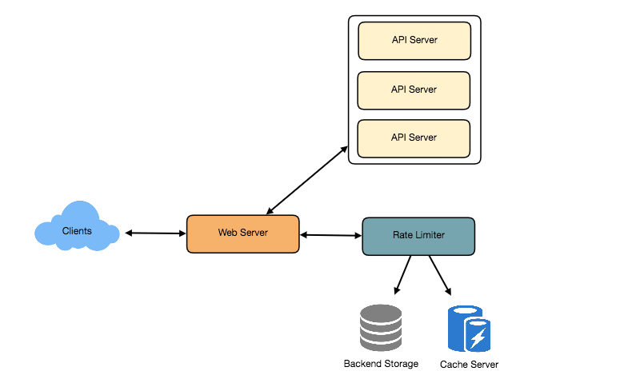

# Rate Limiter Project

This project implements a rate limiter system for the Corporation X,Y,Z notification service, which provides SMS and E-mail notifications. The rate limiter system enforces limits on the number of requests that clients can send, preventing performance issues and ensuring fair resource allocation.

## System Design

The rate limiter system consists of the following components:

- **API Clients**: The clients using the Corporation X,Y,Z notification service to send SMS and E-mail notifications.
- **PostgreSQL Database**: Stores client information, including their monthly rate limits and usage.
- **Redis Cache**: Utilized for tracking and enforcing rate limits on a per-client and system-wide basis.
- **Node.js Application**: Implements the API endpoints and applies rate limiting middleware to enforce the limits.

## Installation

Follow these steps to set up and run the rate limiter project:

1. Clone the repository: `git clone https://github.com/GustaveRw/Rate-Limiter-Project.git`
2. Navigate to the project directory: `cd rate-limiter-project`
3. Install the dependencies: `npm install`
4. Update the PostgreSQL connection string in `src/models/clientModel.js` with your own database credentials.
5. Run the project: `npm start`

## Testing

To run the unit tests for the rate limiter system, use the following command:

The tests are located in the `test/` directory and are organized according to the project structure.

## Contributing

Contributions to the rate limiter project are welcome! If you find any issues or have suggestions for improvements, please open an issue or submit a pull request.

## License

This project is licensed under the [MIT License](LICENSE).

## Author

Jean Marie Gustave MBONYINSHUTI

